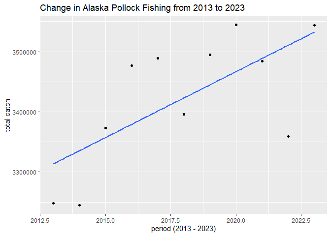
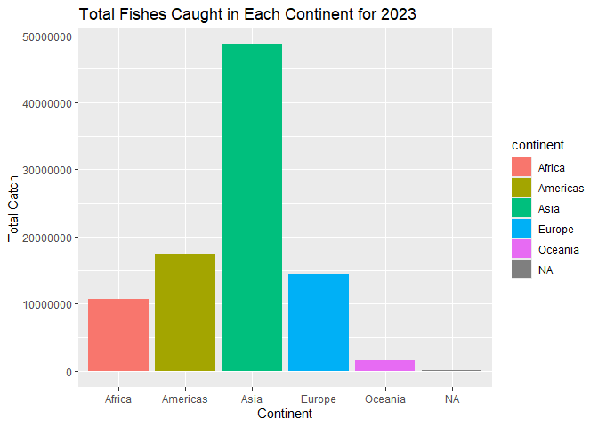

## Instructions
Answer the following questions and/or complete the exercises in RMarkdown. Please embed all of your code and push the final work to your repository. Your report should be organized, clean, and run free from errors. Remember, you must remove the `#` for any included code chunks to run.  

## Load the libraries

``` r
library("tidyverse")
library("janitor")
library("naniar")
options(scipen = 999)
```

## About the Data
For this assignment we are going to work with a data set from the [United Nations Food and Agriculture Organization](https://www.fao.org/fishery/en/collection/capture) on world fisheries. These data were downloaded and cleaned using the `fisheries_clean.Rmd` script.  

Load the data `fisheries_clean.csv` as a new object titled `fisheries_clean`.

``` r
fisheries_clean <- read_csv("data/fisheries_clean.csv") %>% 
  clean_names() #already cleaned, yes, but more including as habit 
```

1. Explore the data. What are the names of the variables, what are the dimensions, are there any NA's, what are the classes of the variables, etc.? You may use the functions that you prefer.

``` r
glimpse(fisheries_clean)
```

```
## Rows: 1,055,015
## Columns: 9
## $ period          <dbl> 1950, 1951, 1952, 1953, 1954, 1955, 1956, 1957, 1958, …
## $ continent       <chr> "Asia", "Asia", "Asia", "Asia", "Asia", "Asia", "Asia"…
## $ geo_region      <chr> "Southern Asia", "Southern Asia", "Southern Asia", "So…
## $ country         <chr> "Afghanistan", "Afghanistan", "Afghanistan", "Afghanis…
## $ scientific_name <chr> "Osteichthyes", "Osteichthyes", "Osteichthyes", "Ostei…
## $ common_name     <chr> "Freshwater fishes NEI", "Freshwater fishes NEI", "Fre…
## $ taxonomic_code  <chr> "1990XXXXXXXX106", "1990XXXXXXXX106", "1990XXXXXXXX106…
## $ catch           <dbl> 100, 100, 100, 100, 100, 200, 200, 200, 200, 200, 200,…
## $ status          <chr> "A", "A", "A", "A", "A", "A", "A", "A", "A", "A", "A",…
```

2. Convert the following variables to factors: `period`, `continent`, `geo_region`, `country`, `scientific_name`, `common_name`, `taxonomic_code`, and `status`.

``` r
fisheries_clean %>% 
  mutate(across(where(is.character), as.factor)) #converts all the listed ones into character. also could do indvidually
```

```
## # A tibble: 1,055,015 × 9
##    period continent geo_region    country     scientific_name common_name       
##     <dbl> <fct>     <fct>         <fct>       <fct>           <fct>             
##  1   1950 Asia      Southern Asia Afghanistan Osteichthyes    Freshwater fishes…
##  2   1951 Asia      Southern Asia Afghanistan Osteichthyes    Freshwater fishes…
##  3   1952 Asia      Southern Asia Afghanistan Osteichthyes    Freshwater fishes…
##  4   1953 Asia      Southern Asia Afghanistan Osteichthyes    Freshwater fishes…
##  5   1954 Asia      Southern Asia Afghanistan Osteichthyes    Freshwater fishes…
##  6   1955 Asia      Southern Asia Afghanistan Osteichthyes    Freshwater fishes…
##  7   1956 Asia      Southern Asia Afghanistan Osteichthyes    Freshwater fishes…
##  8   1957 Asia      Southern Asia Afghanistan Osteichthyes    Freshwater fishes…
##  9   1958 Asia      Southern Asia Afghanistan Osteichthyes    Freshwater fishes…
## 10   1959 Asia      Southern Asia Afghanistan Osteichthyes    Freshwater fishes…
## # ℹ 1,055,005 more rows
## # ℹ 3 more variables: taxonomic_code <fct>, catch <dbl>, status <fct>
```

SKIP QUESTION 3!! 

``` r
#3. Are there any missing values in the data? If so, which variables contain missing values and how many are missing for each variable?
```

4. How many countries are represented in the data?

``` r
fisheries_clean %>% 
  summarize(n_distinct=n_distinct(country))
```

```
## # A tibble: 1 × 1
##   n_distinct
##        <int>
## 1        249
```

249 different countries are represented in the data 


5. The variables `common_name` and `taxonomic_code` both refer to species. How many unique species are represented in the data based on each of these variables? Are the numbers the same or different?

``` r
fisheries_clean %>% 
  summarize(n_distinct_common_name = n_distinct(common_name), n_distinct_taxonomic_code = n_distinct(taxonomic_code))
```

```
## # A tibble: 1 × 2
##   n_distinct_common_name n_distinct_taxonomic_code
##                    <int>                     <int>
## 1                   3390                      3722
```

For 'common_name' there are 3390 unique species represented, while for 'taxonomic_code' there are 3722 represented. Numbers are different. 


6. In 2023, what were the top five countries that had the highest overall catch?

``` r
fisheries_clean %>% 
  filter(period=="2023") %>%
  group_by(country) %>% 
  summarize(sum_catch = sum(catch, na.rm = T)) %>% 
  arrange(desc(sum_catch)) %>% 
  head(sum_catch, n =5)
```

```
## # A tibble: 5 × 2
##   country                  sum_catch
##   <chr>                        <dbl>
## 1 China                    13424705.
## 2 Indonesia                 7820833.
## 3 India                     6177985.
## 4 Russian Federation        5398032 
## 5 United States of America  4623694
```

7. In 2023, what were the top 10 most caught species? To keep things simple, assume `common_name` is sufficient to identify species. What does `NEI` stand for in some of the common names? How might this be concerning from a fisheries management perspective?

``` r
fisheries_clean %>% 
  filter(period=="2023") %>%
  group_by(common_name) %>% 
  summarize(sum_catch = sum(catch, na.rm = T)) %>% 
  arrange(desc(sum_catch)) %>% 
  head(sum_catch, n =10)
```

```
## # A tibble: 10 × 2
##    common_name                    sum_catch
##    <chr>                              <dbl>
##  1 Marine fishes NEI               8553907.
##  2 Freshwater fishes NEI           5880104.
##  3 Alaska pollock(=Walleye poll.)  3543411.
##  4 Skipjack tuna                   2954736.
##  5 Anchoveta(=Peruvian anchovy)    2415709.
##  6 Blue whiting(=Poutassou)        1739484.
##  7 Pacific sardine                 1678237.
##  8 Yellowfin tuna                  1601369.
##  9 Atlantic herring                1432807.
## 10 Scads NEI                       1344190.
```

From my search, I got that nei stands for "not elsewhere included" referring to fishes grouped together as they are not specifically classified in the data. This might be concerning from fisheries management perspective as they don't know how much of a specific fish is being caught, and if any endangered fishes are included in these catches, if there is one fish being overcaught, etc. Just overall hard to manage due to lack of data. 


8. For the species that was caught the most above (not NEI), which country had the highest catch in 2023?

``` r
#the species based on my data would be "Alaska pollock(=Walleye poll.)" 
fisheries_clean %>% 
  filter(period == "2023") %>% 
  filter(common_name == "Alaska pollock(=Walleye poll.)") %>% 
  group_by(country) %>% 
  summarize(sum_catch = sum(catch, na.rm = T)) %>% 
  arrange(desc(sum_catch)) %>% 
  head(n = 1)
```

```
## # A tibble: 1 × 2
##   country            sum_catch
##   <chr>                  <dbl>
## 1 Russian Federation   1893924
```

In 2023 specifically, the Russian Federation had the highest catch of the Alaska pollock. 

9. How has fishing of this species changed over the last decade (2013-2023)? Create a  plot showing total catch by year for this species.

``` r
#two continuous data so can do scatter plot 
fisheries_clean %>% 
  filter(common_name == "Alaska pollock(=Walleye poll.)") %>% 
  filter(period >= 2013, period <= 2023) %>% 
  group_by(period) %>% 
  summarize(total_catch = sum(catch)) %>%  #two continuous so can do scatter plot
  ggplot (mapping=aes(x=period, y=total_catch)) + 
  geom_point (na.rm = T) + 
  geom_smooth (method = lm, se = F) + 
  labs (title = "Change in Alaska Pollock Fishing from 2013 to 2023", x = "period (2013 - 2023)", y = "total catch")
```

```
## `geom_smooth()` using formula = 'y ~ x'
```

<!-- -->
  
10. Perform one exploratory analysis of your choice. Make sure to clearly state the question you are asking before writing any code.

Question: For the most recent period in the data set, what continent had the most fish caught in general? 


``` r
#figure out the most recent period 
fisheries_clean %>% 
  distinct(period) %>% 
  arrange(desc(period)) %>% 
  head(n = 1)
```

```
## # A tibble: 1 × 1
##   period
##    <dbl>
## 1   2023
```

``` r
#from this we know that the most recent period in data is 2023 
#category vs. count... bar plot
fisheries_clean %>% 
  filter (period == 2023) %>% 
  group_by(continent) %>% 
  summarize (total_catch = sum(catch)) %>% 
  ggplot(aes (x = continent, y = total_catch)) +
  geom_col(mapping = aes(fill = continent)) + 
  labs (title = "Total Fishes Caught in Each Continent for 2023", x = "Continent", y = "Total Catch")
```

<!-- -->

Asia had the most fishes caught overall... by a crazy high amount too. 

## Knit and Upload
Please knit your work as an .html file and upload to Canvas. Homework is due before the start of the next lab. No late work is accepted. Make sure to use the formatting conventions of RMarkdown to make your report neat and clean!  
